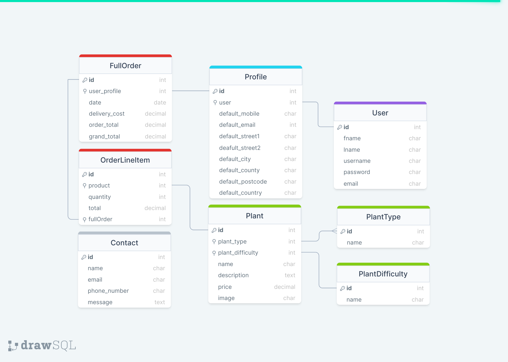
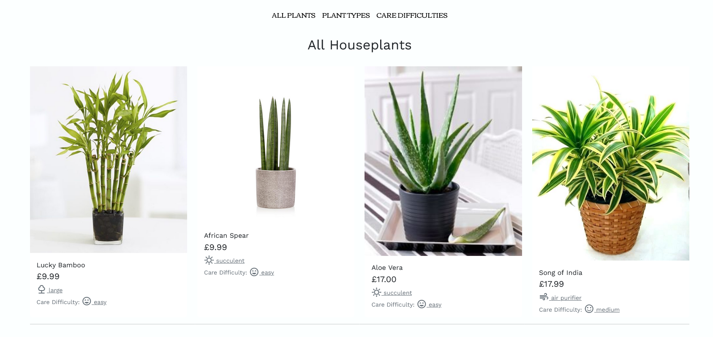

# Deilen

This website is a full stack ecommerce store to allow people to buy house plants and plant related homeware from the mockup plant company Deilen (the Welsh word for 'leaf').

To visit the website, please visit the deployed site [here](insert link to deployed site).

***

## Target Audience
  - Homeowners looking to buy decorative house plants.
  - Interior designers looking to buy plants for indoor spaces e.g., an office space.
  - People looking to gift a house plant to a loved one.

## User Stories

As a user of the Deilen website, I want to:
  1. User Authentication / Accounts
     - Site users should be able to register an account that allows a user to sign in and out of the site.
     - A user should be able to create a profile to store personal information to make checkout easier with default personal information to automatically populate form fields at checkout.
     - Users should be able to ammend profile information to keep records up-to-date and also have the ability to delete their account.
     - A user should be able to reset their password via email authentication so the account is not lost if the password is forgotten.
  2. Site Navigation
     - hello
  3. Shopping
  4. User Checkout
  5. Site Admin

***

## UX

### Colour Scheme
- A earthy and natural blend of pastel pink yellow and green with darker shadesof clay-brown and blue-grey. This gives the website a fresh, organic and natural look.
    >
- No accessibility issues were returned when passing the colour scheme through the official [WebAIM](https://webaim.org/resources/contrastchecker/).
    >

### Typography

- Google Fonts
  Font styles were taken from the open source [Google Fonts](https://fonts.google.com/).
  - the typography for the text throughout the website is [Font Name](Link To Font). Small blurb about font.
  - The typography for the brand logo is font-family [Font Name](Link To Font). Small blurb about font.

***

### Wireframes

- Home wireframe

 

 - Products wireframe

 

 - Shopping bag wireframe

 

 

***

## Database Model
- Database schema for Deilen

 

***

## Features 

### Existing Features 

__Navigation Bar__
  - Allows the user to navigate around the Deilen site. The Deilen logo will direct the user to the homepage, there are also Profile buttons and a button to take a user to their Shopping Cart or "wheelbarrow". The wheelbarrows icon signal if there are items currently sitting in the bag.
  - The search bar allows users to search for a keyterm throughout the site, this is useful if the user has a particular product in mind to purchase.
  - Buttons will be available to the user depending on whether they are logged into their account or not.
  - The mobile navbar condenses all the same elements into a burger menu, this retains screensaver for other elements e.g., products.
  
  
  
  __Footer__
  - The footer contains the address of the company, useful links, business information and links to social media accounts. All of which either open modals or open new tabs directed away from the website.
  - The footer design matches that of the header to give a cohesive feel to the website.
  
  
  __Homepage__
  - The homepage consists of a eye-catching photo to instantly suggest the purpose of the website to the user.
  - There is a section dedicated to advertising company special offers, currently on display is the Halloween offer where free delivery is granted to orders over £666.
  - On the homepage there are also buttons to direct the user to the main shop i.e., to view the plant products and .....
  
  
  __Shop Floor__
  - The shop floor displays the plants that the user is able to buy through the website.
  - Each plant has its own card, the user can see to which category the plant belongs e.g., if the plant is an air purifier or a succulent. The user can also see at a glance the care difficulty of the plant - this informs clients of the attention and care a plant needs and can therefore decide if a plant is suitable for its intended purpose.
  - Each plant product displays a price per item as well as a field to select a quantity of the product (max quantity selection is 99 items of a single product).
  
  
  __Product Filtering__
  - Describe the feature and what it allows a user to do.
  - Does the feature have any defensive programming?
  
  
  __Shopping Bag ("Wheelbarrow")__
  - The wheelbarrow is always accessible to users, even when empty. The wheelbarrow allows users to view what is currently in their bag for purchase. From here, a user can amend their order, continue shopping or proceed to checkout.
  
  
  __Checkout__
  - Once item(s) have been added to the wheelbarrow the user will then be able to checkout. Upon checkout there is a brief review of the users basket i.e., what they intend to purchase. The user will then be required to fill out their delivery information and then proceed to fill out their payment information. Once payment is completed the order is made.
  - Does the feature have any defensive programming?
  

__Feature__
  - Describe the feature and what it allows a user to do.
  - Does the feature have any defensive programming?
   

### Admin Features

Description of what admins have control over

__Feature__

  - Describe the feature and what it allows a admin to do.
  - Does the feature have any defensive programming?

  

### Features Left to Implement 

- Describe the feature
  - Why hasn't it yet been implemented and what steps would you take to start implementing this feature.

***

## Technologies

- [GitPod](https://gitpod.io) was used as a cloud based iDE
- [GitHub](https://github.com/) was used to manage the Git repository
- [Heroku](link to deployed site) was used for deployment
- [Git](https://git-scm.com/) was used for version control
- [Django](https://www.djangoproject.com/) used as the project's web framework
- [Pip3](https://pip.pypa.io/en/stable/) was the package manager used to install the dependencies
- [Bootstrap](https://getbootstrap.com/) was used for website layout and responsive components
- [Google Fonts](https://fonts.google.com/) was used to provide website fonts and icons
- [Am I Responsive](http://ami.responsivedesign.is/) was used to generate a mock-up image
- [Dev Tools](https://en.wikipedia.org/wiki/Web_development_tools) was used for testing and responsiveness
- [Wireframe.cc](https://wireframe.cc/pro/) was used for creating wireframes
- [DrawSQL](https://drawsql.app/) was used for creating the database schema
- [W3C HTML Validator](https://validator.w3.org/#validate_by_input+with_options) and [W3C CSS Validator](https://jigsaw.w3.org/css-validator/#validate_by_input) were used to check HTML and CSS files for errors

### Languages
- [HTML](https://en.wikipedia.org/wiki/HTML) was used as the markup language
- [CSS](https://en.wikipedia.org/wiki/CSS) was used for custom styling
- [JavaScript](https://en.wikipedia.org/wiki/JavaScript) was used for custom website interactivity
- [Python](https://www.python.org/downloads/) was used as ...

***

## Testing

To view all testing documentation, refer to [TESTING.md](TESTING.md).

***

## Deployment

The site was deployed to Heroku. The live link can be found [here](link to deployed site)

The steps to deploy a Heroku app are as follows: 
1.  Log in to Heroku or create an account if required.
2.  Create a Heroku app - select 'New', from the drop-down menu select Create New App. The app name provided must be unique.
3.  Select a region.
4.  Create.
5.  Navigate to the Resources tab and add a Heroku PostgreSQL database.
6.  Access the Settings Tab and find the Config Vars. For this project you will need the following config vars:
    *   MONGO_DBNAME = the name of your mongo database.
    *   MONGO_URI = the uri for your mongo database.
    *   DATABASE_URL = the url of your heroku postgres database.
    *   SECRET_KEY = a secret key for your app.
    *   PORT = 5000
    *   DEBUG = set to 'True' during development and 'False' upon deployment.
    *   IP = Your IP address

  Please see this [official documentation](https://devcenter.heroku.com/articles/config-vars) on Heroku configuration for more details.

7.  Navigate to the Deploy tab.
8.  Select Github as the deployment method.
9.  Follow steps to link to the appropriate GitHub account.
12. If you wish, enable Automatic Deploys for automatic deployment when you push updates to Github. Or alternatively, select the correct branch for deployment from the drop-down menu and click Deploy Branch for manual deployment.

Final steps: 
1. Create a Procfile in your repository containing `web: python run.py` so that Heroku will identify the app as a Python app.
2. Create an untracked file called env.py in your repo and input the config vars you previously established in Heroku.
3. Create a requirements.txt file
    - If you want to freeze your own packages into this file, run `pip3 freeze --local > requirements.txt` in the console.
    - To install only the packages that are already listed in the Deilen repo requirements (if making a local copy/clone) run `pip3 install -r requirements.txt` in the console.

### Cloning

Cloning a repository makes it easier to contribute, fix merge conflicts, add or remove files, and push larger commits. To clone this repository from GitHub to a local computer use the following steps:

1.  On GitHub, navigate to the main page of the repository.

2.  Above the list of files, click Code.

3.  Click Use GitHub CLI, then the copy icon.

4.  Open Git Bash and change the current working directory to the location where you want the cloned directory.

5.  Type git clone, and then paste the URL that was copied from step 3 above - i.e., `git clone https://github.com/antonia-white/deilen.git`

6. Press Enter to create the local clone.

### Forking
A fork is a copy of a repository. Forking a repository allows you to freely experiment with changes without affecting the original project.

To fork this project go to the top left of the repository, where you see the Fork Icon and click Fork.  This will create a copy of the repository for you.

## Credits 

### Content 

- The Returns Policy was generated with [Termly's Return and Refund Policy Generator](https://termly.io/products/refund-return-policy-generator/).
- 

### Media

- Icons were taken from both [Google Font Icons](https://fonts.google.com/icons) and [FontAwesome](https://fontawesome.com/).
- The favicon was generated with [favicon.io](https://favicon.io/) using Twitter emojis.
- The homepage picture was taken from the open source site [Unsplash](https://unsplash.com/).
- The product images were taken from [Kaggle](https://www.kaggle.com/), a website for dataset downloads. Specifically, images were taken from the [Healthy and Wilted Houseplant Images](https://www.kaggle.com/datasets/russellchan/healthy-and-wilted-houseplant-images) dataset. Only healthy houseplant images were used as product images.

### Acknowledgements

- My Code Institute mentor, [Tim Nelson](https://github.com/TravelTimN)
- My friends and family for manually testing the site.

***