# Testing 

## Validator Testing 
- HTML
  - No errors were found in the `home app` when passed through the official [W3C's HTML Validator](https://validator.w3.org/nu/?doc=https://deilen-shop.herokuapp.com/).
    
    [Screenshot of index.html validation](documentation/testing/w3-index.html.png)

  - No errors were found in the `signup.html` file when passed through the official [W3C's HTML Validator](https://validator.w3.org/nu/?doc=https://deilen-shop.herokuapp.com/accounts/signup/).
    
    [Screenshot of signup.html validation](documentation/testing/w3-signup.html.png)

  - No errors were found in the `login.html` file when passed through the official [W3C's HTML Validator](https://validator.w3.org/nu/?doc=https://deilen-shop.herokuapp.com/accounts/login/).
    
    [Screenshot of login.html validation](documentation/testing/w3-login.html.png)

  - No errors were found in the `bag app` when passed through the official [W3C's HTML Validator](https://validator.w3.org/nu/?doc=https://deilen-shop.herokuapp.com/bag/).
    
    [Screenshot of bag validation](documentation/testing/w3-bag.html.png)

  - No errors were found in the `plants app` when passed through the official [W3C's HTML Validator](https://validator.w3.org/nu/?doc=https://deilen-shop.herokuapp.com/plants/).
    
    [Screenshot of plants validation](documentation/testing/w3-plants.html.png)

  - No errors were found in the `plants app` when filtering results by plant type. This was passed through the official [W3C's HTML Validator](https://validator.w3.org/nu/?doc=https://deilen-shop.herokuapp.com/plants/?plant_type=flowering).
    
    [Screenshot of searching by type validation](documentation/testing/w3-plants-searching-type.html.png)

  - No errors were found in the `plants app` when filtering results by care difficulty. This was passed through the official [W3C's HTML Validator](https://validator.w3.org/nu/?doc=https://deilen-shop.herokuapp.com/plants/?plant_difficulty=hard).
    
    [Screenshot of flitering by difficulty validation](documentation/testing/w3-plant-searching-difficulty.html.png)

  - No errors were found in the `contact app` when passed through the official [W3C's HTML Validator](https://validator.w3.org/nu/?doc=https://deilen-shop.herokuapp.com/contact/).
    
    [Screenshot of contact validation](documentation/testing/w3-contact.html.png)

  - No errors were found in the `plant_details.html` file when passed through the official [W3C's HTML Validator](https://validator.w3.org/nu/?doc=https://deilen-shop.herokuapp.com/plants/1/).
    
    [Screenshot of plant details validation](documentation/testing/w3-plant_details.html.png)

- CSS
  - No personal errors were found in any CSS files throughout the site when passed through the official [Jigsaw validator](https://jigsaw.w3.org/css-validator/validator?uri=https%3A%2F%2Fdeilen-shop.herokuapp.com) CSS validator. All errors found were related to Bootstrap documentation and not from my custom CSS files.
  
    >


- JavaScript
  - No errors were found when `countryfield.js` was passed through the official [JSHint](https://jshint.com/) JavaScript validator.

    >

  - No errors were found when `stripe_elements.js` was passed through the official [JSHint](https://jshint.com/) JavaScript validator.

    >


- Python

  - No errors were returned and all code met PEP8 compliance when `bag/contexts.py` file was passed through Code Institute's Python Linter [pep8ish](https://pep8ish.herokuapp.com/). Please find a link to this file in the validator [here](https://pep8ish.herokuapp.com/https://raw.githubusercontent.com/antonia-white/deilen/main/bag/contexts.py).

    [Screenshot of bag/contexts.py validation](documentation/testing/pep8online-py-bag-contexts.py-validator-screenshot.png)

  - No errors were returned and all code met PEP8 compliance when `bag/urls.py` file was passed through Code Institute's Python Linter [pep8ish](https://pep8ish.herokuapp.com/). Please find a link to this file in the validator [here](https://pep8ish.herokuapp.com/https://raw.githubusercontent.com/antonia-white/deilen/main/bag/urls.py).

    [Screenshot of bag/urls.py validation](documentation/testing/pep8online-py-bag-urls.py-validator-screenshot.png)

  - No errors were returned and all code met PEP8 compliance when `bag/models.py` file was passed through Code Institute's Python Linter [pep8ish](https://pep8ish.herokuapp.com/). Please find a link to this file in the validator [here](https://pep8ish.herokuapp.com/https://raw.githubusercontent.com/antonia-white/deilen/main/bag/models.py).

    [Screenshot of bag/models.py validation](documentation/testing/pep8online-py-bag-models.py-validator-screenshot.png)

  - No errors were returned and all code met PEP8 compliance when `bag/views.py` file was passed through Code Institute's Python Linter [pep8ish](https://pep8ish.herokuapp.com/). Please find a link to this file in the validator [here](https://pep8ish.herokuapp.com/https://raw.githubusercontent.com/antonia-white/deilen/main/bag/views.py).

    [Screenshot of bag/views.py validation](documentation/testing/pep8online-py-bag-views.py-validator-screenshot.png)

  - No errors were returned and all code met PEP8 compliance when `checkout/views.py` file was passed through Code Institute's Python Linter [pep8ish](https://pep8ish.herokuapp.com/). Please find a link to this file in the validator [here](https://pep8ish.herokuapp.com/https://raw.githubusercontent.com/antonia-white/deilen/main/checkout/views.py).

    [Screenshot of checkout/views.py validation](documentation/testing/pep8online-py-checkout-views.py-validator-screenshot.png)

  - No errors were returned and all code met PEP8 compliance when `checkout/urls.py` file was passed through Code Institute's Python Linter [pep8ish](https://pep8ish.herokuapp.com/). Please find a link to this file in the validator [here](https://pep8ish.herokuapp.com/https://raw.githubusercontent.com/antonia-white/deilen/main/checkout/urls.py).

    [Screenshot of checkout/urls.py validation](documentation/testing/pep8online-py-checkout-urls.py-validator-screenshot.png)

  - No errors were returned and all code met PEP8 compliance when `checkout/signals.py` file was passed through Code Institute's Python Linter [pep8ish](https://pep8ish.herokuapp.com/). Please find a link to this file in the validator [here](https://pep8ish.herokuapp.com/https://raw.githubusercontent.com/antonia-white/deilen/main/checkout/signals.py).

    [Screenshot of checkout/signals.py validation](documentation/testing/pep8online-py-checkout-signals.py-validator-screenshot.png)

  - No errors were returned and all code met PEP8 compliance when `checkout/models.py` file was passed through Code Institute's Python Linter [pep8ish](https://pep8ish.herokuapp.com/). Please find a link to this file in the validator [here](https://pep8ish.herokuapp.com/https://raw.githubusercontent.com/antonia-white/deilen/main/checkout/models.py).

    [Screenshot of checkout/models.py validation](documentation/testing/pep8online-py-checkout-models.py-validator-screenshot.png)

  - No errors were returned and all code met PEP8 compliance when `checkout/forms.py` file was passed through Code Institute's Python Linter [pep8ish](https://pep8ish.herokuapp.com/). Please find a link to this file in the validator [here](https://pep8ish.herokuapp.com/https://raw.githubusercontent.com/antonia-white/deilen/main/checkout/forms.py).

    [Screenshot of checkout/forms.py validation](documentation/testing/pep8online-py-checkout-forms.py-validator-screenshot.png)

  - No errors were returned and all code met PEP8 compliance when `checkout/apps.py` file was passed through Code Institute's Python Linter [pep8ish](https://pep8ish.herokuapp.com/). Please find a link to this file in the validator [here](https://pep8ish.herokuapp.com/https://raw.githubusercontent.com/antonia-white/deilen/main/checkout/apps.py).

    [Screenshot of checkout/apps.py validation](documentation/testing/pep8online-py-checkout-apps.py-validator-screenshot.png)

  - No errors were returned and all code met PEP8 compliance when `contact/views.py` file was passed through Code Institute's Python Linter [pep8ish](https://pep8ish.herokuapp.com/). Please find a link to this file in the validator [here](https://pep8ish.herokuapp.com/https://raw.githubusercontent.com/antonia-white/deilen/main/contact/views.py).

    [Screenshot of contact/views.py validation](documentation/testing/pep8online-py-contact-views.py-validator-screenshot.png)

  - No errors were returned and all code met PEP8 compliance when `contact/urls.py` file was passed through Code Institute's Python Linter [pep8ish](https://pep8ish.herokuapp.com/). Please find a link to this file in the validator [here](https://pep8ish.herokuapp.com/https://raw.githubusercontent.com/antonia-white/deilen/main/contact/urls.py).

    [Screenshot of contact/urls.py validation](documentation/testing/pep8online-py-contact-urls.py-validator-screenshot.png)

  - No errors were returned and all code met PEP8 compliance when `contact/models.py` file was passed through Code Institute's Python Linter [pep8ish](https://pep8ish.herokuapp.com/). Please find a link to this file in the validator [here](https://pep8ish.herokuapp.com/https://raw.githubusercontent.com/antonia-white/deilen/main/contact/models.py).

    [Screenshot of contact/models.py validation](documentation/testing/pep8online-py-contact-models.py-validator-screenshot.png)

  - No errors were returned and all code met PEP8 compliance when `contact/forms.py` file was passed through Code Institute's Python Linter [pep8ish](https://pep8ish.herokuapp.com/). Please find a link to this file in the validator [here](https://pep8ish.herokuapp.com/https://raw.githubusercontent.com/antonia-white/deilen/main/contact/forms.py).

    [Screenshot of contact/forms.py validation](documentation/testing/pep8online-py-contact-forms.py-validator-screenshot.png)

  - No errors were returned and all code met PEP8 compliance when `contact/admin.py` file was passed through Code Institute's Python Linter [pep8ish](https://pep8ish.herokuapp.com/). Please find a link to this file in the validator [here](https://pep8ish.herokuapp.com/https://raw.githubusercontent.com/antonia-white/deilen/main/contact/admin.py).

    [Screenshot of contact/admin.py validation](documentation/testing/pep8online-py-contact-admin.py-validator-screenshot.png)

  - No errors were returned and all code met PEP8 compliance when `deilen/settings.py` file was passed through Code Institute's Python Linter [pep8ish](https://pep8ish.herokuapp.com/). Please find a link to this file in the validator [here](https://pep8ish.herokuapp.com/https://raw.githubusercontent.com/antonia-white/deilen/main/deilen/settings.py).

    [Screenshot of deilen/settings.py validation](documentation/testing/pep8online-py-deilen-settings.py-validator-screenshot.png)

  - No errors were returned and all code met PEP8 compliance when `deilen/urls.py` file was passed through Code Institute's Python Linter [pep8ish](https://pep8ish.herokuapp.com/). Please find a link to this file in the validator [here](https://pep8ish.herokuapp.com/https://raw.githubusercontent.com/antonia-white/deilen/main/deilen/urls.py).

    [Screenshot of deilen/urls.py validation](documentation/testing/pep8online-py-deilen-urls.py-validator-screenshot.png)

  - No errors were returned and all code met PEP8 compliance when `home/views.py` file was passed through Code Institute's Python Linter [pep8ish](https://pep8ish.herokuapp.com/). Please find a link to this file in the validator [here](https://pep8ish.herokuapp.com/https://raw.githubusercontent.com/antonia-white/deilen/main/home/views.py).

    [Screenshot of home/views.py validation](documentation/testing/pep8online-py-home-views.py-validator-screenshot.png)

  - No errors were returned and all code met PEP8 compliance when `home/urls.py` file was passed through Code Institute's Python Linter [pep8ish](https://pep8ish.herokuapp.com/). Please find a link to this file in the validator [here](https://pep8ish.herokuapp.com/https://raw.githubusercontent.com/antonia-white/deilen/main/home/urls.py).

    [Screenshot of home/urls.py validation](documentation/testing/pep8online-py-home-urls.py-validator-screenshot.png)

  - No errors were returned and all code met PEP8 compliance when `home/models.py` file was passed through Code Institute's Python Linter [pep8ish](https://pep8ish.herokuapp.com/). Please find a link to this file in the validator [here](https://pep8ish.herokuapp.com/https://raw.githubusercontent.com/antonia-white/deilen/main/home/models.py).

    [Screenshot of home/models.py validation](documentation/testing/pep8online-py-home-models.py-validator-screenshot.png)

  - No errors were returned and all code met PEP8 compliance when `home/admin.py` file was passed through Code Institute's Python Linter [pep8ish](https://pep8ish.herokuapp.com/). Please find a link to this file in the validator [here](https://pep8ish.herokuapp.com/https://raw.githubusercontent.com/antonia-white/deilen/main/home/admin.py).

    [Screenshot of home/admin.py validation](documentation/testing/pep8online-py-home-admin.py-validator-screenshot.png)

  - No errors were returned and all code met PEP8 compliance when `plants/views.py` file was passed through Code Institute's Python Linter [pep8ish](https://pep8ish.herokuapp.com/). Please find a link to this file in the validator [here](https://pep8ish.herokuapp.com/https://raw.githubusercontent.com/antonia-white/deilen/main/plants/views.py).

    [Screenshot of plants/views.py validation](documentation/testing/pep8online-py-plants-views.py-validator-screenshot.png)

  - No errors were returned and all code met PEP8 compliance when `plants/urls.py` file was passed through Code Institute's Python Linter [pep8ish](https://pep8ish.herokuapp.com/). Please find a link to this file in the validator [here](https://pep8ish.herokuapp.com/https://raw.githubusercontent.com/antonia-white/deilen/main/plants/urls.py).

    [Screenshot of plants/urls.py validation](documentation/testing/pep8online-py-plants-urls.py-validator-screenshot.png)

  - No errors were returned and all code met PEP8 compliance when `plants/models.py` file was passed through Code Institute's Python Linter [pep8ish](https://pep8ish.herokuapp.com/). Please find a link to this file in the validator [here](https://pep8ish.herokuapp.com/https://raw.githubusercontent.com/antonia-white/deilen/main/plants/models.py).

    [Screenshot of plants/models.py validation](documentation/testing/pep8online-py-plants-models.py-validator-screenshot.png)

  - No errors were returned and all code met PEP8 compliance when `plants/forms.py` file was passed through Code Institute's Python Linter [pep8ish](https://pep8ish.herokuapp.com/). Please find a link to this file in the validator [here](https://pep8ish.herokuapp.com/https://raw.githubusercontent.com/antonia-white/deilen/main/plants/forms.py).

    [Screenshot of plants/forms.py validation](documentation/testing/pep8online-py-plants-forms.py-validator-screenshot.png)

  - No errors were returned and all code met PEP8 compliance when `plants/custom_context_processor.py` file was passed through Code Institute's Python Linter [pep8ish](https://pep8ish.herokuapp.com/). Please find a link to this file in the validator [here](https://pep8ish.herokuapp.com/https://raw.githubusercontent.com/antonia-white/deilen/main/plants/custom_context_processor.py).

    [Screenshot of plants/custom_context_processor.py validation](documentation/testing/pep8online-py-plants-custom_context_processor.py-validator-screenshot.png)

  - No errors were returned and all code met PEP8 compliance when `plants/admin.py` file was passed through Code Institute's Python Linter [pep8ish](https://pep8ish.herokuapp.com/). Please find a link to this file in the validator [here](https://pep8ish.herokuapp.com/https://raw.githubusercontent.com/antonia-white/deilen/main/plants/admin.py).

    [Screenshot of plants/admin.py validation](documentation/testing/pep8online-py-plants-admin.py-validator-screenshot.png)

  - No errors were returned and all code met PEP8 compliance when `profiles/views.py` file was passed through Code Institute's Python Linter [pep8ish](https://pep8ish.herokuapp.com/). Please find a link to this file in the validator [here](https://pep8ish.herokuapp.com/https://raw.githubusercontent.com/antonia-white/deilen/main/profiles/views.py).

    [Screenshot of profiles/views.py validation](documentation/testing/pep8online-py-profiles-views.py-validator-screenshot.png)

  - No errors were returned and all code met PEP8 compliance when `profiles/urls.py` file was passed through Code Institute's Python Linter [pep8ish](https://pep8ish.herokuapp.com/). Please find a link to this file in the validator [here](https://pep8ish.herokuapp.com/https://raw.githubusercontent.com/antonia-white/deilen/main/profiles/urls.py).

    [Screenshot of profiles/urls.py validation](documentation/testing/pep8online-py-profiles-urls.py-validator-screenshot.png)

  - No errors were returned and all code met PEP8 compliance when `profiles/models.py` file was passed through Code Institute's Python Linter [pep8ish](https://pep8ish.herokuapp.com/). Please find a link to this file in the validator [here](https://pep8ish.herokuapp.com/https://raw.githubusercontent.com/antonia-white/deilen/main/profiles/models.py).

    [Screenshot of profiles/models.py validation](documentation/testing/pep8online-py-profiles-models.py-validator-screenshot.png)

  - No errors were returned and all code met PEP8 compliance when `profiles/forms.py` file was passed through Code Institute's Python Linter [pep8ish](https://pep8ish.herokuapp.com/). Please find a link to this file in the validator [here](https://pep8ish.herokuapp.com/https://raw.githubusercontent.com/antonia-white/deilen/main/profiles/forms.py).

    [Screenshot of profiles/forms.py validation](documentation/testing/pep8online-py-profiles-forms.py-validator-screenshot.png)

  - No errors were returned and all code met PEP8 compliance when `profiles/admin.py` file was passed through Code Institute's Python Linter [pep8ish](https://pep8ish.herokuapp.com/). Please find a link to this file in the validator [here](https://pep8ish.herokuapp.com/https://raw.githubusercontent.com/antonia-white/deilen/main/profiles/admin.py).

    [Screenshot of profiles/admin.py validation](documentation/testing/pep8online-py-profiles-admin.py-validator-screenshot.png)

  - No errors were returned and all code met PEP8 compliance when `manage.py` file was passed through Code Institute's Python Linter [pep8ish](https://pep8ish.herokuapp.com/). Please find a link to this file in the validator [here](https://pep8ish.herokuapp.com/https://raw.githubusercontent.com/antonia-white/deilen/main/manage.py).

    [Screenshot of manage.py validation](documentation/testing/pep8online-py-manage.py-validator-screenshot.png)

***

### Fixed Bugs

I used the built-in [GitHub Issues](https://github.com/antonia-white/deilen/issues) tracker for tracking any active bugs during development. 
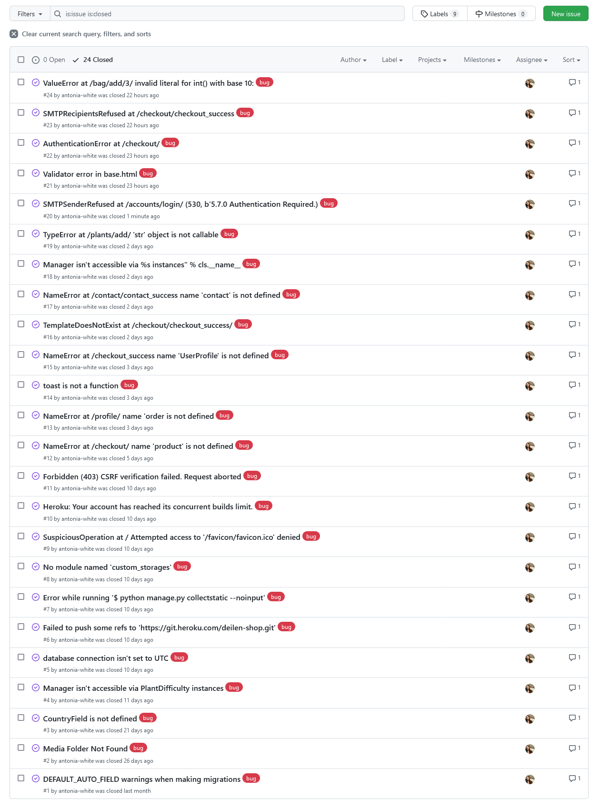

Here are the issues tracked that have been closed and working as intended:

- DEFAULT_AUTO_FIELD warnings when making migrations [#1](https://github.com/antonia-white/deilen/issues/1)
- Media Folder Not Found [#2](https://github.com/antonia-white/deilen/issues/2)
- CountryField is not defined [#3](https://github.com/antonia-white/deilen/issues/3)
- Manager isn't accessible via PlantDifficulty instances [#4](https://github.com/antonia-white/deilen/issues/4)
- database connection isn't set to UTC [#5](https://github.com/antonia-white/deilen/issues/5)
- Failed to push some refs to 'https://git.heroku.com/deilen-shop.git' [#6](https://github.com/antonia-white/deilen/issues/6)
- Error while running '$ python manage.py collectstatic --noinput' [#7](https://github.com/antonia-white/deilen/issues/7)
- No module named 'custom_storages' [#8](https://github.com/antonia-white/deilen/issues/8)
- SuspiciousOperation at / Attempted access to '/favicon/favicon.ico' denied [#9](https://github.com/antonia-white/deilen/issues/9)
- Heroku: Your account has reached its concurrent builds limit. [#10](https://github.com/antonia-white/deilen/issues/10)
- Forbidden (403) CSRF verification failed. Request aborted [#11](https://github.com/antonia-white/deilen/issues/11)
- NameError at /checkout/ name 'product' is not defined [#12](https://github.com/antonia-white/deilen/issues/12)
- NameError at /profile/ name 'order is not defined [#13](https://github.com/antonia-white/deilen/issues/13)
- toast is not a function [#14](https://github.com/antonia-white/deilen/issues/14)
- NameError at /checkout_success name 'UserProfile' is not defined [#15](https://github.com/antonia-white/deilen/issues/15)
- TemplateDoesNotExist at /checkout/checkout_success/ [#16](https://github.com/antonia-white/deilen/issues/16)
- NameError at /contact/contact_success name 'contact' is not defined [#17](https://github.com/antonia-white/deilen/issues/17)
- Manager isn't accessible via %s instances" % cls.__name_ [#18](https://github.com/antonia-white/deilen/issues/18)
- TypeError at /plants/add/ 'str' object is not callable [#19](https://github.com/antonia-white/deilen/issues/19)
- SMTPSenderRefused at /accounts/login/ (530, b'5.7.0 Authentication Required.) [#20](https://github.com/antonia-white/deilen/issues/20)
- Validator error in base.html [#21](https://github.com/antonia-white/deilen/issues/21)
- AuthenticationError at /checkout/ [#22](https://github.com/antonia-white/deilen/issues/22)
- SMTPRecipientsRefused at /checkout/checkout_success [#23](https://github.com/antonia-white/deilen/issues/23)
- ValueError at /bag/add/3/ invalid literal for int() with base 10: [#24](https://github.com/antonia-white/deilen/issues/24)

***

## Unfixed Bugs 

To the best of my knowledge, there are no unfixed-bugs.

***

## Browser Compatibility

- Website launched successfully on [Firefox](https://www.mozilla.org/en-GB/firefox/new/):

  >

- Website launched successfully on [Google Chrome](https://www.google.com/intl/en_uk/chrome/):

  >

- Website launched successfully on [Microsoft Edge](https://www.microsoft.com/en-us/edge):

  >

***

## Responsiveness

- Website viewed on a mobile device:

  >

- Website viewed on a tablet device:

  >

- Website viewed on a laptop device:

  >


***

## User Story Testing

A target user of the Deilen website will want to:

- [x] Register an account
   >Users can register an account at Deilen, the backend of this functionality is handled by [django-allauth](https://django-allauth.readthedocs.io/en/latest/installation.html).
   >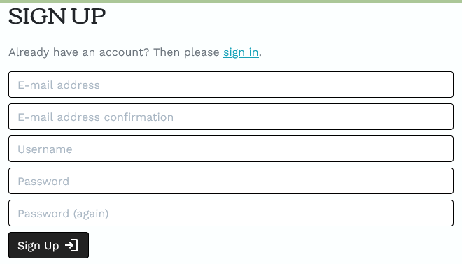

- [x] Store personal default delivery information
   >Profile owners can store their default delivery information - making checkout easier as the delivery section of the order form auto-populates.

- [x] Amend profile information
   >Default delivery information can be updated.
   >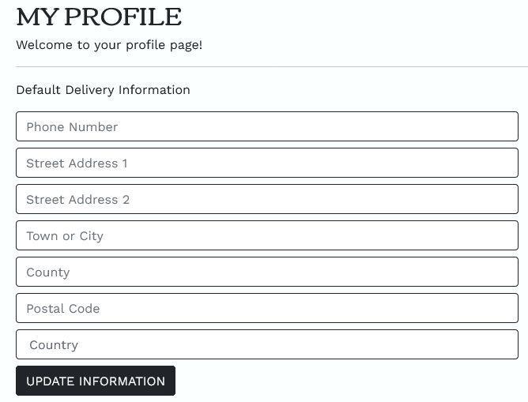

- [x] View past orders
   >Profile owners will be able to view their previous order history.
   >

- [x] Reset their profile password
   >Profile owners will be able to reset their password via email-authentication, this functionality is handled by [django-allauth](https://django-allauth.readthedocs.io/en/latest/
   >

- [x] Navigate the site
   >The navbar and footer make it easy for users to navigate the site as well as useful buttons and internal links throughout the website. The site is simple to navigate regardless of device type.
   >
   >

- [x] View Deilen products
   >All Deilen products can be viewed on the shop floor.
   >

- [x] Filter Deilen products
   >Products can be filtered by plant type, care difficulties, price and alphabetically. Users are aslo albe to search specific keywords in the search bar.
   >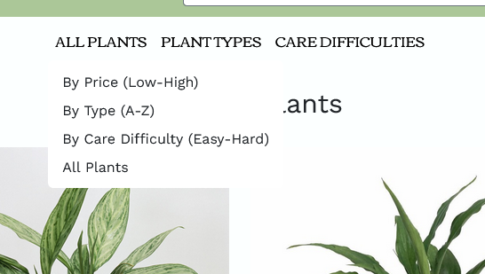
   >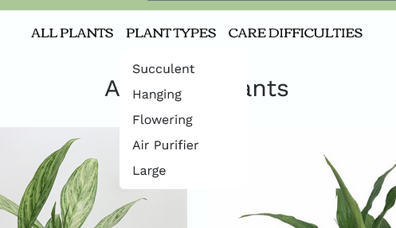
   >

- [x] Purchase Deilen products
   >Users can purchase products by adding the desired quantities to their wheelbarrow (shopping bag) and continuing with checkout to pay and finalise their order.
   >

- [x] Ammend their order
   >In the wheelbarrow (shopping bag) users will be giver an overview of their proposed purchase. Users can then ammend quantities of an item, remove items competley and continue shopping if they desire. At checkout, users will again be given an overview of their bag and prompted again to ammend their order if neccessary.
   >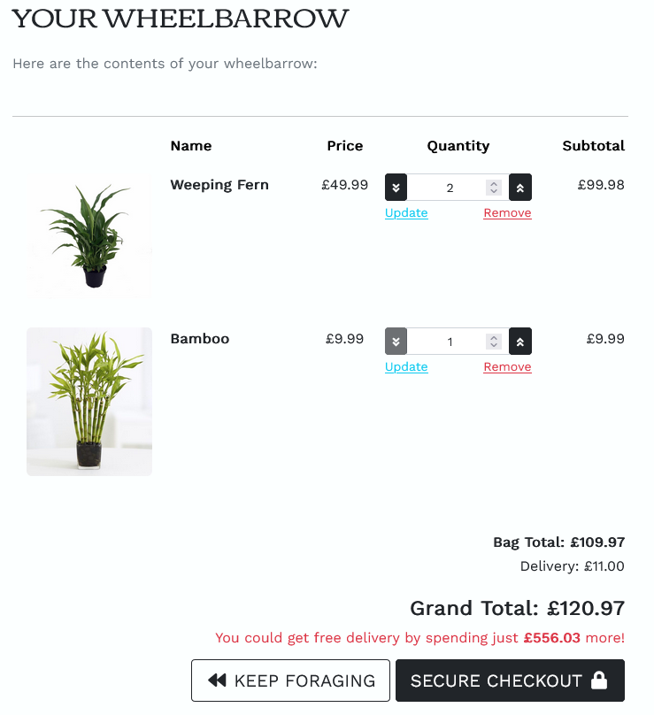

- [x] See an order summary with all cost details
   >An order summary is listed in the wheelbarrow and again at checkout showing all costs and total cost of the purchase. There are no hidden costs. The amount that a user will be charged is clearly displayed before purchase.
   >

- [x] Checkout safley and securley
   >The site uses Stripe Payments to acheive safe and secure transactions. More can be read about this at [Stripe.com](https://stripe.com/en-gb).
   >

- [x] Recieve order confirmation
   >Once an order has been made, the user will be shown the checkout success page which informs the user that their order has been processed. Email confirmation will also be sent to the user. Additionally, if a user has a profile they will be able to see processed order in their order history on their profile.
   >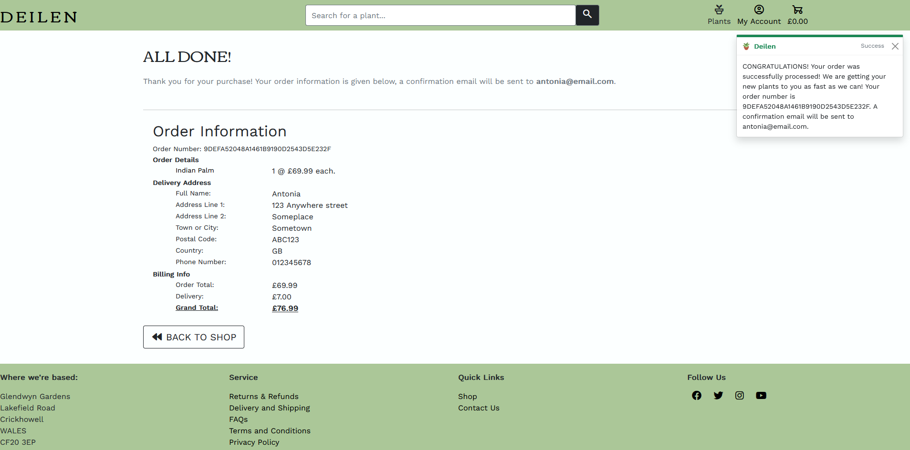
   >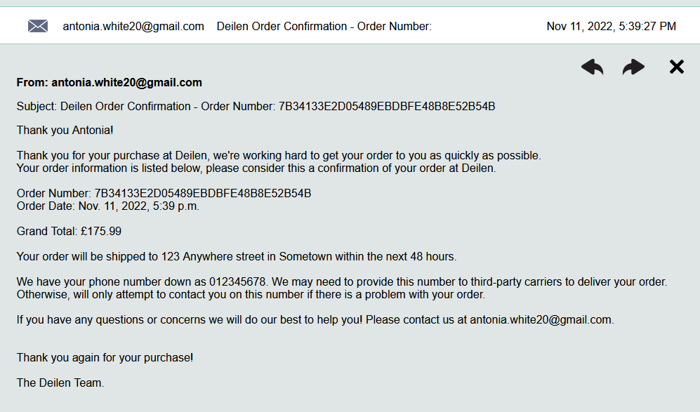

- [x] Contact Deilen
   >Store users will nee to be able to contact Deilen if they have any questions or need help with their order. The website has multiple useful links in the footer which outline compnay policy on returns and refunds, delivery and shipping, terms and condidtions, and provacy policy as well as an FAQs section. These links are full of customer information they may wish to ead before making a purchase. If store users have any other queires or concerns, there is a contact us section where a form is submitted with a customer message.
   >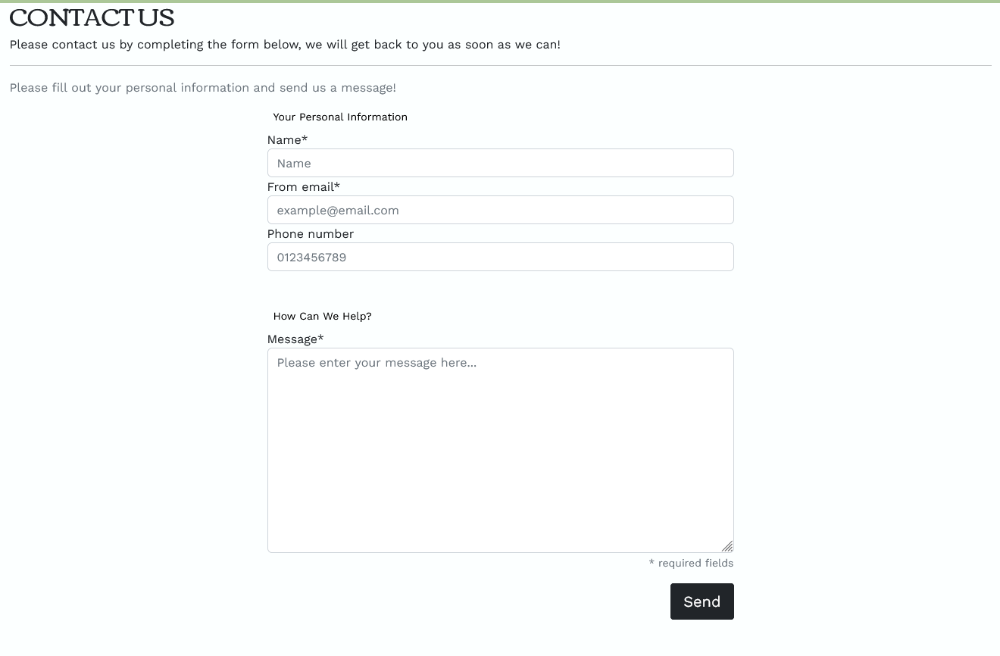

- [x] Manage their account
   >Users are able to login, logout, register, confirm their email addresses, and reset their password. All of this functionality is handled by [django-allauth](https://django-allauth.readthedocs.io/en/latest/installation.html).

A admin of the Deilen website will want to:

- [x] Have secure access to product manipulation
   >Login is required to access any urls regarding product management. If the user logged in is not identified as an admin of the site, they will be redirected and thrown an error. Only admins have access to admin priviledges.
   >

- [x] Add new products
   >Admins can easily add new products by navigating to the product management section under their account. Completing and submitting the form will result in a new product being displayed on the site.
   >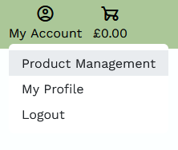
   >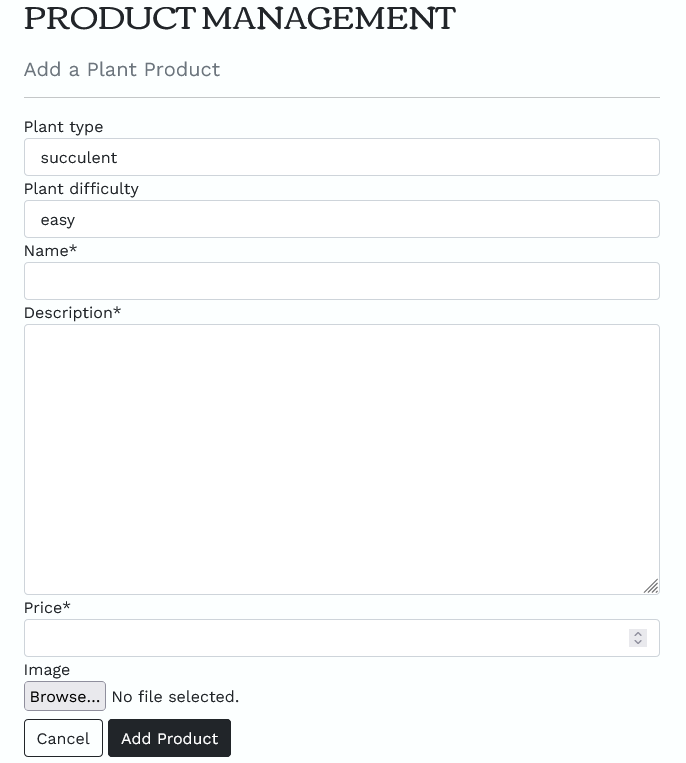

- [x] Edit existing products
   >From a products details page, an admin can easily update the details of said product.
   >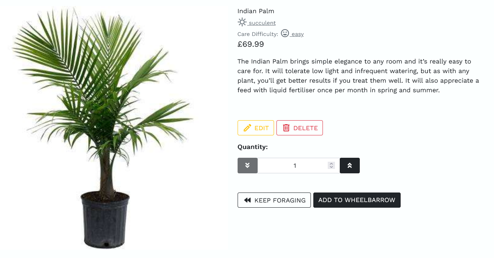

- [x] Delete products
   >From a products details page, an admin can easily delete said product. Before deletion a modal is triggered to ensure no accidental deletion.
   >

- [x] View all orders, products, product categories, and customer messages
   >All of this information can be viewed when an admin logs into the customised django admin. Django provides a built in admin interface which acts as a internal management tool. More information can be read about Django admin [here](https://docs.djangoproject.com/en/4.1/ref/contrib/admin/). Deilen's django admin can be accessed [here](https://deilen-shop.herokuapp.com/admin/) (please note, admin login is required). 
   >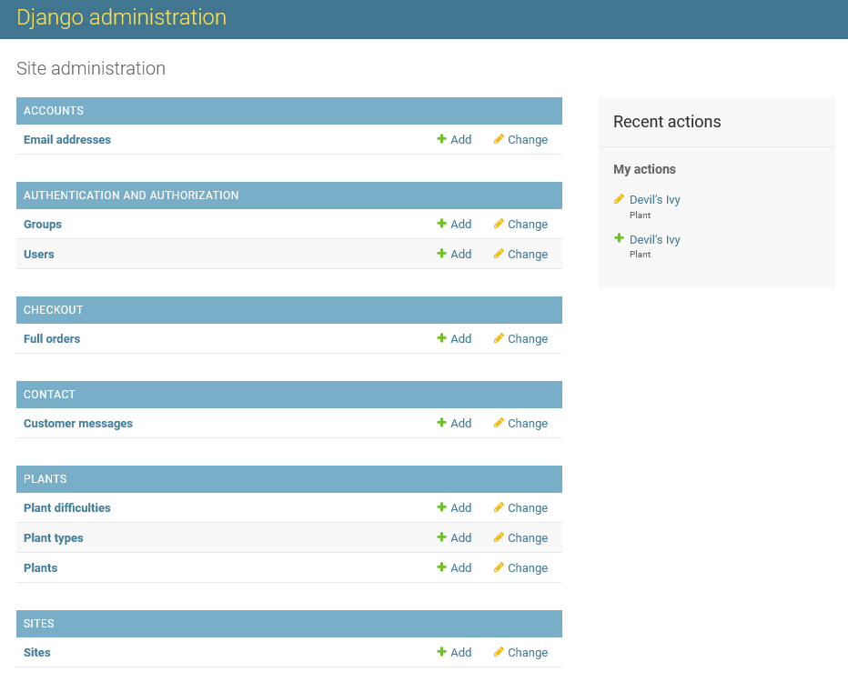

***

## Defensive Programming Testing

- Code implemented on all admin features to require user login and to verify that the logged in user has admin status. If a user is not logged in or is not an admin, they will be redirected and unable to perform admin privileges. This works even when trying to brute force a url.
  `@login_required` on admin views to require user to be logged in. The following code was user to verify admin status:
  ```
  if not request.user.is_superuser:
        messages.error(request, "Sorry, no access - admins only!")
        return redirect(reverse("home"))
  ```
  If the user is a superuser i.e., admin, then they will not be redirected and will have access to admin functionality. This functionality was manually tested and deemed to be functioning correctly.
